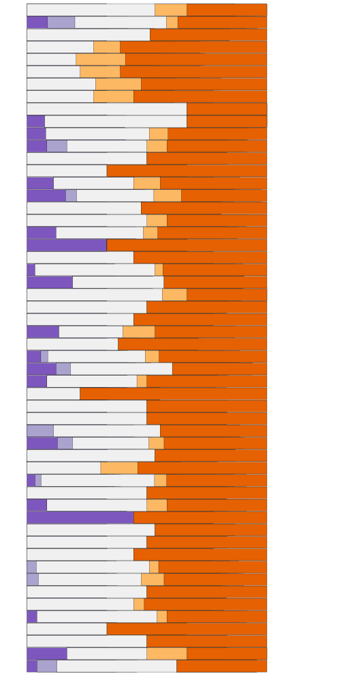

# Conviscope

The front end re-implementattion of Conviscope using the newest version of D3.js (5.16.0)

## Get Started

In terminal, run `python3 -m http.server 8000`, and go to http://0.0.0.0:8000/ in browser.

## Current Layout

